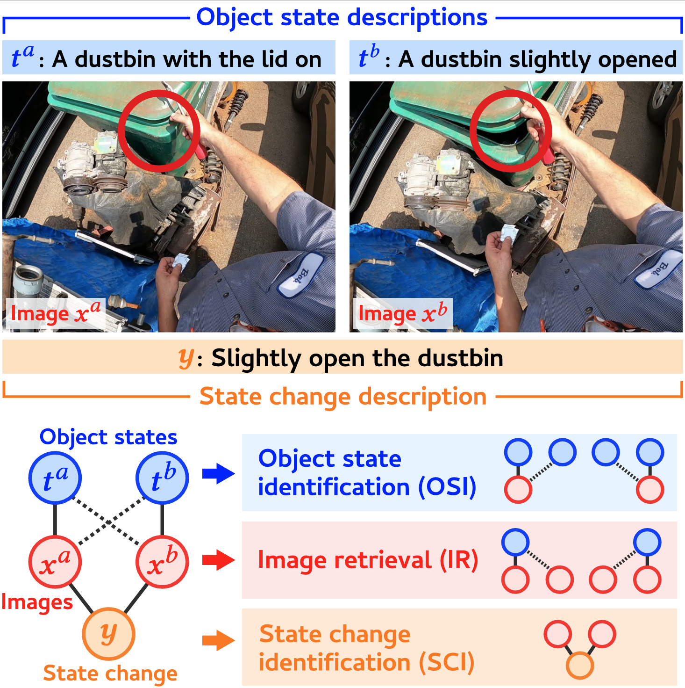

# STATUS Bench
You can check our paper [this link](https://arxiv.org/abs/2510.22571)!




## Abstract

Object state recognition aims to identify the specific condition of objects, such as their positional states (e.g., open or closed) and functional states (e.g., on or off).
While recent Vision-Language Models (VLMs) are capable of performing a variety of multimodal tasks, it remains unclear how precisely they can identify object states.
To alleviate this issue, we introduce the STAte and Transition UnderStanding Benchmark (STATUS Bench),
the first benchmark for rigorously evaluating the ability of VLMs to understand subtle variations in object states in diverse situations.
Specifically, STATUS Bench introduces a novel evaluation scheme that requires VLMs to perform three tasks simultaneously: object state identification (OSI), image retrieval (IR), and state change identification (SCI).
These tasks are defined over our fully hand-crafted dataset involving image pairs, their corresponding object state descriptions and state change descriptions.
Furthermore, we introduce a large-scale training dataset, namely STATUS Train, which consists of 13 million semi-automatically created descriptions.
This dataset serves as the largest resource to facilitate further research in this area.
In our experiments, we demonstrate that STATUS Bench enables rigorous consistency evaluation and reveal that current state-of-the-art VLMs still significantly struggle to capture subtle object state distinctions.
Surprisingly, under the proposed rigorous evaluation scheme, most open-weight VLMs exhibited chance-level zero-shot performance.
After fine-tuning on STATUS Train, Qwen2.5-VL achieved performance comparable 
to Gemini 2.0 Flash.
These findings underscore the necessity of STATUS Bench and Train for advancing object state recognition in VLM research.

## STATUS dataset

You can download the JSON files from the links below:

- [STATUS Train](https://huggingface.co/datasets/tsukinohotori/STATUS_Train): Training dataset
- [STATUS Bench](./Bench/STATUS_Bench.json): Benchmarking dataset
- Please extract images from Ego4D dataset (please follow the instructions below).

## Extracting images

### Environment Setup

Install the OpenCV library:

```bash
pip install opencv-python
```

Download STATUS_Train.json from [this link](https://huggingface.co/datasets/tsukinohotori/STATUS_Train) and place it in your directory following the structure below.

```
STATUS_Bench/
├─ Bench/
|  └─ STATUS_Bench.json
├─ Train/
|  └─ STATUS_Train.json
└─ extract_frames.py
```

### Script

```bash
cd /path/to/STATUSBench/
python extract_frames.py --video_path /path/to/ego4d/v1/full_scale/ --train --bench
# If you want to skip extracting images for STATUS Train, simply omit the --train flag.
```

## Acknowledgements

- [Ego4D](https://ego4d-data.org/)

## License
This dataset annotations are distributed under CC BY-SA 4.0. Please also follow Ego4D license for videos and images.

## Citation

```
@inproceedings{Ukai_2025_ACMMM,
author = {Ukai, Mahiro and Kurita, Shuhei and Inoue, Nakamasa},
title = {STATUS Bench: A Rigorous Benchmark for Evaluating Object State Understanding in Vision-Language Models},
year = {2025},
booktitle = {Proceedings of the 33rd ACM International Conference on Multimedia},
pages = {4718–4727}
}
```